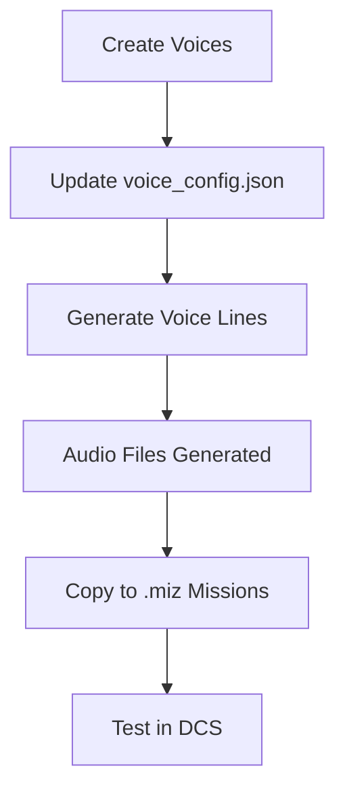

# ElevenLabs Voice Generation Integration

Complete system for generating DCS mission voice lines using ElevenLabs AI Text-to-Speech API.

---

## 📁 Folder Structure

```
elevenlabs-integration/
├── scripts/               Python generation scripts
│   ├── generate_voice_lines.py          # Generate with single voice
│   ├── generate_with_custom_voices.py   # Generate with multiple voices
│   ├── create_voices_api.py             # Create voices via API
│   ├── list_my_voices.py                # List all your voices
│   └── test_*.py                        # Test scripts
├── docs/                  Complete documentation
│   ├── ELEVENLABS-SETUP.md              # Initial setup guide
│   ├── CUSTOM-VOICES.md                 # Custom voice management
│   ├── VOICE-IDEAS.md                   # 15 voice ideas with prompts
│   ├── VOICE-PROMPTS-QUICK.md           # Quick copy/paste prompts
│   ├── VOICE-LINES.md                   # Master voice line catalog
│   ├── QUICK-START-CUSTOM-VOICES.md     # 5-minute quick start
│   ├── README-API-VOICE-CREATION.md     # API voice creation guide
│   └── INDEX.md                         # Complete documentation index
├── config/                Configuration files
│   ├── voice_config.json                # Your voice assignments
│   ├── voice_config.template.json       # Template for new configs
│   └── created_voices.json              # API-created voice IDs
├── test_files/            Test audio files
├── voice_previews/        Voice preview samples
└── README.md              This file
```

---

## 🚀 Quick Start

### 1. Setup (First Time)

```bash
cd elevenlabs-integration

# Install dependencies
pip install elevenlabs python-dotenv

# Set API key (in project root .env file)
# Already done: ELEVENLABS_API_KEY=your-key-here
```

See `docs/ELEVENLABS-SETUP.md` for detailed setup.

### 2. List Your Voices

```bash
cd scripts
python list_my_voices.py
```

### 3. Generate Voice Lines

**Option A: Single Voice**
```bash
python generate_voice_lines.py --voice-id YOUR_VOICE_ID
```

**Option B: Multiple Voices (Recommended)**
```bash
python generate_with_custom_voices.py
```
Uses `config/voice_config.json` to assign different voices to different categories.

### 4. Create New Voices via API

```bash
# Create 4 priority voices
python create_voices_api.py

# Create specific voices
python create_voices_api.py --voices awacs,jtac,fighter

# Auto mode (faster, uses first preview)
python create_voices_api.py --auto
```

---

## 📚 Documentation

| Document | Purpose |
|----------|---------|
| **[docs/INDEX.md](docs/INDEX.md)** | Complete documentation index |
| **[docs/ELEVENLABS-SETUP.md](docs/ELEVENLABS-SETUP.md)** | Initial API setup |
| **[docs/VOICE-LINES.md](docs/VOICE-LINES.md)** | 47 voice lines catalog |
| **[docs/CUSTOM-VOICES.md](docs/CUSTOM-VOICES.md)** | Voice management guide |
| **[docs/VOICE-IDEAS.md](docs/VOICE-IDEAS.md)** | 15 voice ideas with prompts |
| **[docs/VOICE-PROMPTS-QUICK.md](docs/VOICE-PROMPTS-QUICK.md)** | Quick copy/paste prompts |

---

## 🎯 Common Tasks

### Create Voice via API
```bash
cd scripts
python create_voices_api.py --prompt "Your description" --name "Voice Name"
```

### Generate All Voice Lines
```bash
cd scripts
python generate_with_custom_voices.py
```
Output: `mission assets/audio/generic/` folders

### Test Single Voice
```bash
cd scripts
python test_single_line.py
```
Output: `test_files/`

### List Available Voices
```bash
cd scripts
python list_my_voices.py
```

---

## 🔧 Configuration

### voice_config.json

Assigns voices to categories:

```json
{
  "voices": {
    "ground_troops": {
      "voice_id": "abc123...",
      "name": "Sgt Butterfield",
      "categories": ["Requesting Support", "Taking Fire", ...]
    },
    "mission_control": {
      "voice_id": "def456...",
      "name": "AWACS - Magic",
      "categories": ["Mission Start", "Mission Complete", ...]
    }
  },
  "default_voice": "ground_troops"
}
```

Located: `config/voice_config.json`

---

## 📊 Voice Lines Catalog

**47 voice lines** across 14 categories:

### Ground Troops
- Requesting Support (7 lines)
- Reacting to Good Strike (5 lines)
- Taking Fire / Under Attack (5 lines)
- Target Spotted / Tally (5 lines)
- Winchester / Bingo (4 lines)
- Negative Results / Miss (3 lines)
- Friendly Fire Warning (3 lines)

### Mission Control
- Mission Start (5 lines)
- Mission Complete (5 lines)
- Abort / Waveoff (3 lines)

### Threats
- SAM Warning (3 lines)
- Enemy Aircraft (2 lines)
- Weather / Visibility (2 lines)

See `docs/VOICE-LINES.md` for complete list.

---

## 🎤 Your Current Voices

### Custom Voices (8 total)
- **Sgt Butterfield** - Combat ground (African-American, excited)
- **Sgt Brown** - Combat ground (American, high-energy)
- **Twr Marcus** - Military controller (calm, authoritative)
- **Twr Bazza** - Ground controller (Australian, direct)
- **Capt Lockyer** - Briefing officer (Australian, serious)
- **Capt Willis** - Fighter pilot (American with Southern hint)
- **Cprl Ronny May** - Helicopter pilot (Australian, relaxed)
- **AWACS - Magic** - AWACS controller (professional, calm) ✨ NEW

---

## 🔄 Workflow



### Complete Workflow

1. **Create voices:**
   ```bash
   python scripts/create_voices_api.py
   ```

2. **List voices & get IDs:**
   ```bash
   python scripts/list_my_voices.py
   ```

3. **Update config:**
   Edit `config/voice_config.json` with voice IDs

4. **Generate lines:**
   ```bash
   python scripts/generate_with_custom_voices.py
   ```

5. **Output location:**
   `mission assets/audio/generic/`

6. **Copy to DCS:**
   Copy files to `.miz` file's `l10n/DEFAULT/` folder

7. **Use in mission:**
   ```lua
   DMS.Audio.play("generic/ground-troops/good-strike/good-kill.mp3")
   ```

---

## 💰 Cost Tracking

### ElevenLabs API Usage

| Feature | Free Tier | Cost |
|---------|-----------|------|
| **Characters/month** | 10,000 | $0 |
| **Voice designs** | 10 | $0 |
| **Voice cloning** | ❌ | $5+/mo |

### Current Usage Estimate

- **All 47 voice lines:** ~2,000 characters
- **Can generate complete set:** 5x per month (free tier)
- **Voice designs used:** 1/10 (AWACS created)

---

## 📖 Learning Path

### Beginner
1. Read `docs/ELEVENLABS-SETUP.md`
2. Run `python scripts/list_my_voices.py`
3. Generate with single voice: `python scripts/generate_voice_lines.py --voice-id ID`

### Intermediate
1. Read `docs/CUSTOM-VOICES.md`
2. Create `config/voice_config.json`
3. Generate with multiple voices: `python scripts/generate_with_custom_voices.py`

### Advanced
1. Read `docs/VOICE-IDEAS.md`
2. Create voices via API: `python scripts/create_voices_api.py`
3. Add custom prompts and test

---

## 🐛 Troubleshooting

### API Key Not Found
```bash
# Check .env in project root
cat ../../.env
# Should show: ELEVENLABS_API_KEY=sk_...
```

### Voice ID Not Found
```bash
python scripts/list_my_voices.py
# Verify voice exists and copy correct ID
```

### Import Errors
```bash
pip install --upgrade elevenlabs python-dotenv
```

### Audio Generation Fails
- Check character quota: https://elevenlabs.io/usage
- Verify voice ID is correct
- Check internet connection

---

## 📞 Support

### Documentation
- Complete index: `docs/INDEX.md`
- Setup guide: `docs/ELEVENLABS-SETUP.md`
- Voice management: `docs/CUSTOM-VOICES.md`

### External Resources
- [ElevenLabs API Docs](https://elevenlabs.io/docs/api-reference/authentication)
- [Voice Library](https://elevenlabs.io/voice-library)
- [DCS Scripting Wiki](https://wiki.hoggitworld.com)

---

## 🎯 Next Steps

1. ✅ **Setup complete** - API key configured
2. ✅ **First voice created** - AWACS - Magic
3. ⏳ **Create more voices** - JTAC, Fighter, Ground Commander
4. ⏳ **Generate all lines** - 47 voice lines
5. ⏳ **Test in DCS** - Copy to mission and test

---

**Ready to create professional voice lines for DCS missions!** 🎤✈️
