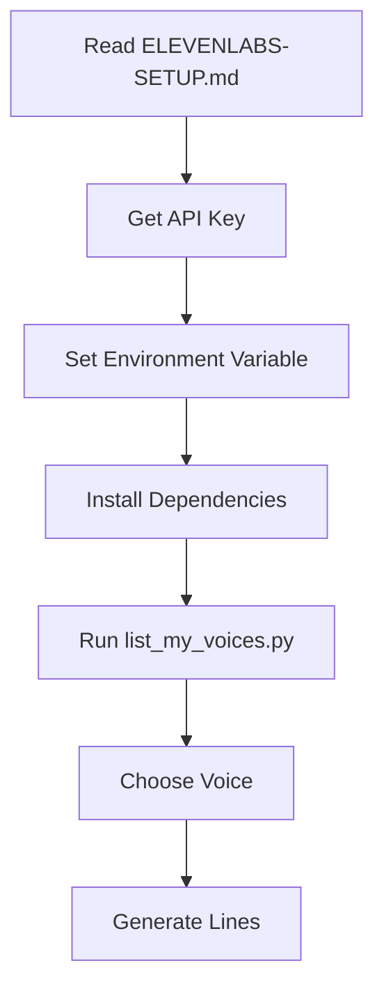
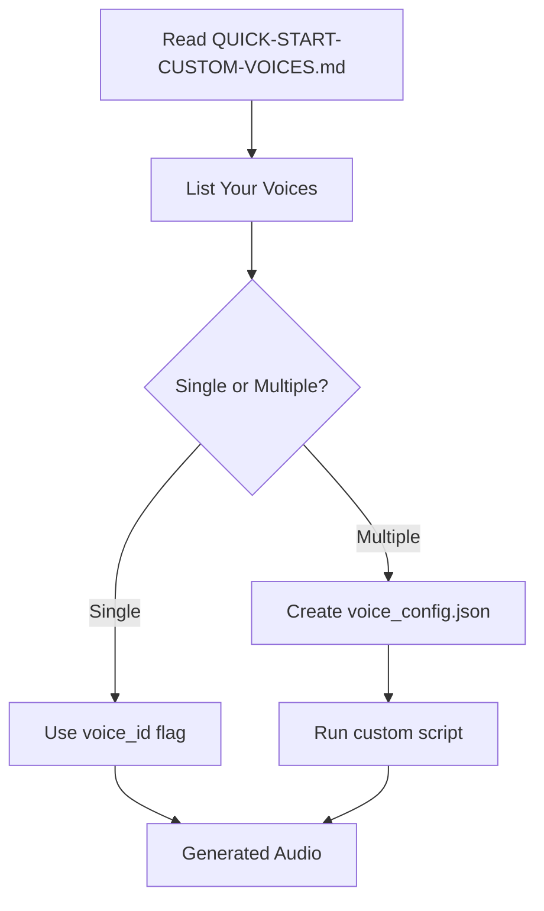
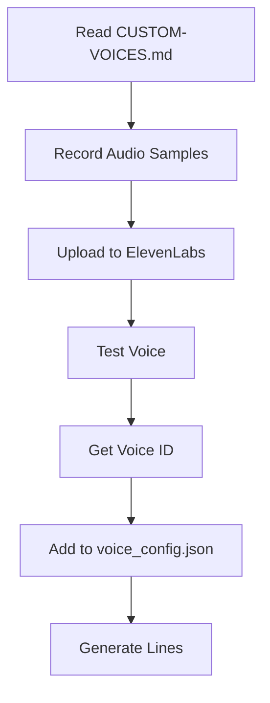
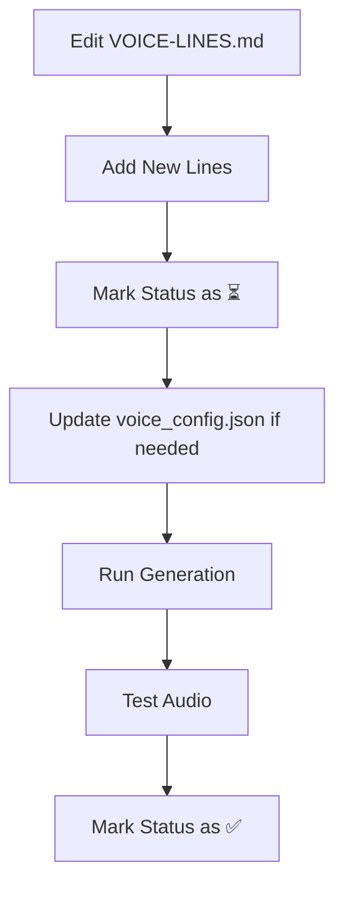

# Audio System Documentation Index

Complete index of all documentation, scripts, and resources for the DCS voice line generation system.

---

## 📖 Documentation Files

| File | Purpose | Audience |
|------|---------|----------|
| **[README.md](README.md)** | Main documentation and quick reference | Everyone |
| **[QUICK-START-CUSTOM-VOICES.md](QUICK-START-CUSTOM-VOICES.md)** | 5-minute setup for users with custom voices | Existing ElevenLabs users |
| **[ELEVENLABS-SETUP.md](ELEVENLABS-SETUP.md)** | Complete API setup instructions | New users |
| **[CUSTOM-VOICES.md](CUSTOM-VOICES.md)** | Custom voice management guide | Advanced users |
| **[VOICE-LINES.md](VOICE-LINES.md)** | Master catalog of all voice lines | Content creators |
| **INDEX.md** | This file - complete system index | Developers |

---

## 🐍 Python Scripts

| Script | Purpose | Usage |
|--------|---------|-------|
| **[generate_voice_lines.py](generate_voice_lines.py)** | Generate lines with single voice | `python generate_voice_lines.py --voice-id ID` |
| **[generate_with_custom_voices.py](generate_with_custom_voices.py)** | Generate with multiple voice profiles | `python generate_with_custom_voices.py` |
| **[list_my_voices.py](list_my_voices.py)** | List all your ElevenLabs voices | `python list_my_voices.py` |

---

## 📋 Configuration Files

| File | Purpose | Status |
|------|---------|--------|
| **[voice_config.template.json](voice_config.template.json)** | Template for voice profiles | Template - copy to `voice_config.json` |
| **voice_config.json** | Your voice profile configuration | User-created (not in git) |
| **.env** | Environment variables | User-created (not in git) |

---

## 🎤 Generated Audio

| Folder | Contents |
|--------|----------|
| **generic/ground-troops/** | Combat communications |
| **generic/mission/** | Mission control communications |
| **generic/threats/** | Warning and threat callouts |
| **missions/** | Mission-specific voice lines |

---

## 🎯 Quick Access by Task

### I want to...

#### Set up for the first time
→ [ELEVENLABS-SETUP.md](ELEVENLABS-SETUP.md)

#### Use my custom ElevenLabs voices
→ [QUICK-START-CUSTOM-VOICES.md](QUICK-START-CUSTOM-VOICES.md)

#### Create new custom voices
→ [CUSTOM-VOICES.md](CUSTOM-VOICES.md) - "Creating Custom Voices" section

#### See what voice lines are available
→ [VOICE-LINES.md](VOICE-LINES.md)

#### Generate voice lines now
```bash
# Single voice
python generate_voice_lines.py --voice-id YOUR_ID

# Multiple voices
python generate_with_custom_voices.py
```

#### Find my voice IDs
```bash
python list_my_voices.py
```

#### Add new voice lines
1. Edit [VOICE-LINES.md](VOICE-LINES.md)
2. Mark status as ⏳
3. Run generation script

#### Test audio quality
→ [CUSTOM-VOICES.md](CUSTOM-VOICES.md) - "Testing Custom Voices" section

#### Troubleshoot issues
→ [README.md](README.md) - "Troubleshooting" section
→ [ELEVENLABS-SETUP.md](ELEVENLABS-SETUP.md) - "Troubleshooting" section

#### Integrate with DCS missions
→ [README.md](README.md) - "Use in DCS Missions" section
→ See `lua-library/comms/audio-player.lua` for DMS.Audio API

---

## 🔄 Common Workflows

### Workflow 1: First-Time Setup



**Steps:**
1. [ELEVENLABS-SETUP.md](ELEVENLABS-SETUP.md) - Get API key
2. `pip install elevenlabs python-dotenv`
3. `python list_my_voices.py`
4. `python generate_voice_lines.py --voice-id YOUR_ID`

---

### Workflow 2: Using Custom Voices



**Steps:**
1. [QUICK-START-CUSTOM-VOICES.md](QUICK-START-CUSTOM-VOICES.md)
2. `python list_my_voices.py`
3. `cp voice_config.template.json voice_config.json`
4. Edit `voice_config.json` with your IDs
5. `python generate_with_custom_voices.py`

---

### Workflow 3: Creating New Custom Voice



**Steps:**
1. [CUSTOM-VOICES.md](CUSTOM-VOICES.md) - "Creating Custom Voices"
2. Record audio samples (see recording tips)
3. Upload to ElevenLabs Voice Lab
4. Copy voice ID
5. Add to `voice_config.json`
6. `python generate_with_custom_voices.py`

---

### Workflow 4: Adding New Voice Lines



**Steps:**
1. Edit [VOICE-LINES.md](VOICE-LINES.md)
2. Add new category or lines
3. Mark as ⏳ (needs generation)
4. `python generate_voice_lines.py` or `python generate_with_custom_voices.py`
5. Listen and verify
6. Update status to ✅

---

## 📊 System Architecture

```
User Request
    ↓
Documentation Files (README, SETUP, CUSTOM-VOICES)
    ↓
Configuration (voice_config.json, .env)
    ↓
Python Scripts (generate_*.py, list_my_voices.py)
    ↓
ElevenLabs API
    ↓
Generated Audio Files (generic/**, missions/**)
    ↓
DCS Mission .miz Files (l10n/DEFAULT/)
    ↓
DMS.Audio Lua Library
    ↓
In-Game Audio Playback
```

---

## 🔧 Configuration Options

### Environment Variables

| Variable | Purpose | Example |
|----------|---------|---------|
| `ELEVENLABS_API_KEY` | API authentication | `sk_abc123...` |

### Voice Settings (in scripts)

| Parameter | Range | Purpose |
|-----------|-------|---------|
| `stability` | 0.0-1.0 | Lower = more expressive |
| `similarity_boost` | 0.0-1.0 | Higher = more consistent |
| `style` | 0.0-1.0 | Exaggeration level |
| `use_speaker_boost` | boolean | Enhanced clarity |

### Category Voice Settings

Pre-configured in `generate_voice_lines.py`:
- **Urgent categories:** stability=0.3
- **Calm categories:** stability=0.7
- **Default:** stability=0.5

---

## 📚 External Resources

### ElevenLabs Documentation
- [API Reference](https://elevenlabs.io/docs/api-reference/authentication)
- [Voice Library](https://elevenlabs.io/voice-library)
- [Voice Cloning Guide](https://elevenlabs.io/docs/product/voice-cloning)
- [Python SDK](https://github.com/elevenlabs/elevenlabs-python)

### DCS Scripting
- [Scripting Engine Documentation](https://wiki.hoggitworld.com/view/Simulator_Scripting_Engine)
- [Trigger Actions](https://wiki.hoggitworld.com/view/DCS_command_outSound)
- Audio System: `lua-library/comms/audio-player.lua`

### Project Resources
- Voice Line Catalog: [VOICE-LINES.md](VOICE-LINES.md)
- Audio Player: `../../lua-library/comms/audio-player.lua`
- Mission Files: `../../miz-files/`

---

## 🎓 Learning Path

### Beginner
1. Read [README.md](README.md) - Overview
2. Follow [ELEVENLABS-SETUP.md](ELEVENLABS-SETUP.md)
3. Run `python generate_voice_lines.py --dry-run`
4. Generate with default voice

### Intermediate
1. Read [CUSTOM-VOICES.md](CUSTOM-VOICES.md)
2. Run `python list_my_voices.py`
3. Test different voices
4. Create `voice_config.json`
5. Use multiple voice profiles

### Advanced
1. Create custom voices via Voice Cloning
2. Record professional audio samples
3. Tune voice settings per category
4. Integrate with mission scripts
5. Add mission-specific voice lines

---

## 📝 File Naming Conventions

### Voice Lines
- Lowercase
- Hyphens for spaces
- No special characters
- Max 80 characters
- Example: `we-need-air-support-now.mp3`

### Voice IDs
- ElevenLabs format: 20-character alphanumeric
- Example: `pNInz6obpgDQGcFmaJgB`

### Configuration
- JSON format with UTF-8 encoding
- Use descriptive names for voice profiles
- Include descriptions for documentation

---

## 🐛 Debugging

### Enable Debug Output

```python
# In generate_voice_lines.py or generate_with_custom_voices.py
# Add at top of main():
import logging
logging.basicConfig(level=logging.DEBUG)
```

### Common Issues

| Error | Solution | Reference |
|-------|----------|-----------|
| API key not found | Set environment variable | [SETUP](ELEVENLABS-SETUP.md) |
| Voice ID invalid | Run `list_my_voices.py` | [CUSTOM](CUSTOM-VOICES.md) |
| Rate limit exceeded | Wait or upgrade plan | [README](README.md) |
| Module not found | Run `pip install` | [SETUP](ELEVENLABS-SETUP.md) |

---

## 🎯 Success Checklist

### Setup Complete When:
- ✅ API key set in environment
- ✅ Dependencies installed
- ✅ `list_my_voices.py` runs successfully
- ✅ Can generate test audio

### Ready for Production When:
- ✅ All voice lines generated
- ✅ Audio quality verified
- ✅ Files organized by category
- ✅ Integrated in DCS mission
- ✅ Tested in-game

---

## 🔄 Version History

| Version | Date | Changes |
|---------|------|---------|
| 1.0.0 | 2025-01-03 | Initial release with 47 voice lines |

---

## 🤝 Contributing

### Adding Voice Lines
1. Edit [VOICE-LINES.md](VOICE-LINES.md)
2. Follow existing format
3. Test generation
4. Update documentation

### Improving Scripts
1. Test changes thoroughly
2. Update docstrings
3. Maintain backward compatibility
4. Update this index

---

## 📞 Support

### Documentation Issues
- Check all docs in this folder
- Read [CUSTOM-VOICES.md](CUSTOM-VOICES.md) for advanced topics
- See [ELEVENLABS-SETUP.md](ELEVENLABS-SETUP.md) troubleshooting

### API Issues
- ElevenLabs Help: https://help.elevenlabs.io
- API Status: https://status.elevenlabs.io

### DCS Integration
- DCS Forums: https://forum.dcs.world
- Hoggit Wiki: https://wiki.hoggitworld.com

---

**Complete system documentation for DCS voice line generation!** 🎤✈️

*Last updated: 2025-01-03*
