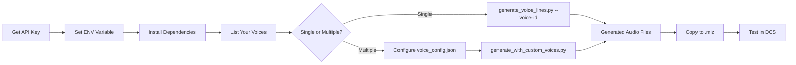

# Quick Start: Using Your Custom Voices

**For users who already have an ElevenLabs account with custom voices**

---

## 5-Minute Setup

### Step 1: Get Your API Key (2 minutes)

1. Go to: https://elevenlabs.io/app/settings/api-keys
2. Click **"Create API Key"**
3. Name it "DCS Voice Lines"
4. Copy the key immediately!

### Step 2: Set Environment Variable (1 minute)

**Windows:**
```cmd
setx ELEVENLABS_API_KEY "your-api-key-here"
```

**Linux/Mac:**
```bash
export ELEVENLABS_API_KEY="your-api-key-here"
echo 'export ELEVENLABS_API_KEY="your-api-key-here"' >> ~/.bashrc
```

**⚠️ RESTART YOUR TERMINAL** after setting the variable!

### Step 3: Install Dependencies (1 minute)

```bash
cd "mission assets/audio"
pip install elevenlabs python-dotenv
```

### Step 4: Get Your Voice IDs (1 minute)

```bash
python list_my_voices.py
```

This will show:
```
🎤 CUSTOM Ground Commander - Iron 6
  ID: abc123XYZ456def789
  Description: Deep authoritative male, combat veteran
  Gender: male
  Age: middle aged

🎤 CUSTOM JTAC - Hawkeye
  ID: ghi789UVW012jkl345
  Description: Forward air controller, professional
  Gender: male
  Age: young

📢 DEFAULT Adam
  ID: pNInz6obpgDQGcFmaJgB
  ...
```

**Copy the IDs of your custom voices!**

---

## Using Your Custom Voices

### Option 1: Single Voice (Easiest)

Use one custom voice for all lines:

```bash
python generate_voice_lines.py --voice-id abc123XYZ456def789
```

Done! Audio files will be generated in `generic/` folders.

---

### Option 2: Multiple Voices (Professional)

Use different voices for different categories (ground troops, mission control, warnings, etc.)

#### Setup (One-Time):

1. **Copy template:**
   ```bash
   copy voice_config.template.json voice_config.json
   ```
   Or on Linux/Mac:
   ```bash
   cp voice_config.template.json voice_config.json
   ```

2. **Edit `voice_config.json`:**

   ```json
   {
     "voices": {
       "ground_commander": {
         "voice_id": "abc123XYZ456def789",  ← Your voice ID here
         "name": "Ground Commander - Iron 6",
         "description": "Combat veteran, urgent capable",
         "categories": [
           "Requesting Support",
           "Taking Fire / Under Attack",
           "Target Spotted / Tally"
         ]
       },
       "mission_control": {
         "voice_id": "ghi789UVW012jkl345",  ← Another voice ID
         "name": "AWACS - Magic",
         "description": "Calm professional controller",
         "categories": [
           "Mission Start",
           "Mission Complete"
         ]
       }
     },
     "default_voice": "ground_commander"
   }
   ```

3. **Generate:**
   ```bash
   python generate_with_custom_voices.py
   ```

#### Result:

```
Ground Commander - Iron 6:
  ✅ "We need air support, NOW!"
  ✅ "We're taking fire!"
  ✅ "Visual on hostile armor!"

AWACS - Magic:
  ✅ "Mission is a go. Good hunting."
  ✅ "All objectives complete. RTB."
```

---

## What Gets Generated

All 47 voice lines from `VOICE-LINES.md`:

```
generic/
├── ground-troops/
│   ├── requesting-support/
│   │   ├── we-need-air-support-now.mp3
│   │   ├── taking-heavy-fire-requesting-cas-immediately.mp3
│   │   └── ...
│   ├── good-strike/
│   ├── taking-fire/
│   └── ...
├── mission/
│   ├── mission-start/
│   ├── mission-complete/
│   └── ...
└── threats/
    ├── sam-warning/
    └── enemy-aircraft/
```

---

## Quick Commands Reference

| Task | Command |
|------|---------|
| **List your voices** | `python list_my_voices.py` |
| **Generate with single voice** | `python generate_voice_lines.py --voice-id YOUR_ID` |
| **Generate with multiple voices** | `python generate_with_custom_voices.py` |
| **Preview (no API calls)** | `python generate_voice_lines.py --dry-run` |
| **List all voices to JSON** | `python list_my_voices.py --json` |

---

## Testing Generated Audio

1. **Listen to files:**
   - Open `generic/` folders
   - Play MP3 files in your media player
   - Verify quality and emotion

2. **Test in DCS:**
   - Copy audio files to `.miz` mission's `l10n/DEFAULT/` folder
   - Use in mission script:
     ```lua
     DMS.Audio.play("generic/ground-troops/good-strike/good-kill-good-kill.mp3")
     ```

---

## Troubleshooting

### "ELEVENLABS_API_KEY not found"

```bash
# Check if set
echo %ELEVENLABS_API_KEY%  # Windows
echo $ELEVENLABS_API_KEY   # Linux/Mac

# If empty, restart terminal or set again
```

### "Voice ID not found"

Run `python list_my_voices.py` to see valid voice IDs.

### "Permission denied" or "pip not found"

Make sure Python is installed and in PATH:
```bash
python --version  # Should show 3.8+
pip --version     # Should show pip version
```

### Audio quality issues

- Try different voices
- Check source audio quality (if cloned)
- See [CUSTOM-VOICES.md](CUSTOM-VOICES.md) for voice tuning tips

---

## Adding More Custom Voices

Want to create new voices for your missions?

### Via ElevenLabs Website:

1. Go to: https://elevenlabs.io/app/voice-lab
2. Click **"Add Voice"**
3. Choose method:
   - **Voice Cloning:** Upload audio samples (requires paid plan)
   - **Voice Design:** Describe desired characteristics (free!)

### Tips for Military Voices:

**Ground Troops:**
- Record with urgency/stress
- Use military terminology
- Quick, clipped speech

**Mission Control:**
- Calm, professional tone
- Clear enunciation
- Steady pacing

See [CUSTOM-VOICES.md](CUSTOM-VOICES.md) for complete guide on creating and recording custom voices.

---

## Cost Management

### Free Tier:
- 10,000 characters/month
- All 47 lines ≈ 2,000 characters
- **Can generate complete set 5x per month**

### Paid Plans:
- **Starter ($5/mo):** 30,000 chars + voice cloning
- **Creator ($22/mo):** 100,000 chars + professional cloning
- **Pro ($99/mo):** 500,000 chars + full features

### Tips:
- Use `--dry-run` to preview first
- Script skips existing files automatically
- Only pending lines (⏳) are generated

---

## Full Documentation

- **[VOICE-LINES.md](VOICE-LINES.md)** - Complete voice line catalog
- **[CUSTOM-VOICES.md](CUSTOM-VOICES.md)** - Complete custom voice guide
- **[ELEVENLABS-SETUP.md](ELEVENLABS-SETUP.md)** - Detailed setup instructions
- **[README.md](README.md)** - Full system documentation

---

## Workflow Summary



---

**You're ready to create professional voice lines for your DCS missions!** 🎤✈️

Questions? See the full documentation files or open an issue.
