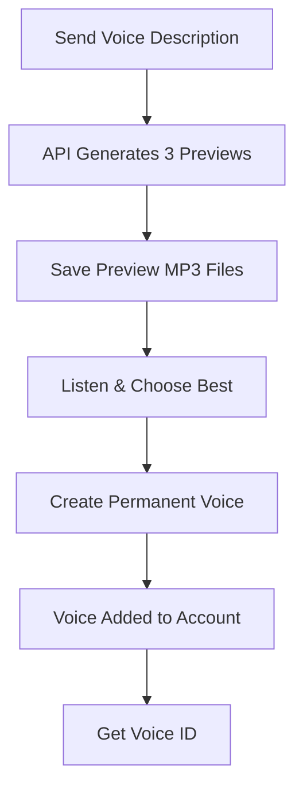

# Voice Creation via API

Guide to creating custom voices programmatically using the ElevenLabs Voice Design API.

---

## Quick Start

### Create 4 Priority Voices (Interactive)

```bash
cd "mission assets/audio"
python create_voices_api.py
```

This will create:
1. **AWACS - Magic** (Controller)
2. **JTAC - Hawkeye** (Forward Air Controller)
3. **Fighter - Viper (F)** (Female Fighter Pilot)
4. **Ground - Anvil 6** (Calm Ground Commander)

**Interactive mode:**
- Generates 3 preview samples for each voice
- Saves previews as MP3 files
- You listen and choose the best one
- Selected voice is saved to your account

---

## How It Works

### Voice Design API Workflow



### Two-Step Process

**Step 1: Design Voice (Generate Previews)**
- POST `/v1/text-to-voice/design`
- Send voice description prompt
- Receive 3 preview samples with `generated_voice_id`
- Each preview includes base64-encoded MP3 audio

**Step 2: Create Voice (Save to Account)**
- POST `/v1/text-to-voice`
- Send chosen `generated_voice_id` and voice name
- Voice permanently saved to your account
- Receive permanent `voice_id` for use in generation

---

## Usage Examples

### Example 1: Interactive Mode (Recommended)

```bash
python create_voices_api.py
```

**What happens:**
1. Script generates 3 previews for each voice
2. Saves preview MP3s to `voice_previews/` folder
3. You listen to previews
4. You select best one (1-3)
5. Selected voice saved to your account

**Output:**
```
Creating: AWACS - Magic
  Generating previews...
  ✅ Generated 3 preview(s)

  Saving 3 preview(s) to voice_previews/
    1. voice_previews/AWACS_-_Magic_preview_1.mp3
    2. voice_previews/AWACS_-_Magic_preview_2.mp3
    3. voice_previews/AWACS_-_Magic_preview_3.mp3

  Preview text: "All callsigns, mission is a go. Good hunting out there."

  Select preview to save (1-3, or 's' to skip): 2

  Creating permanent voice: AWACS - Magic
  ✅ Voice created successfully!
  Voice ID: abc123XYZ456def789
```

---

### Example 2: Automatic Mode (Faster)

```bash
python create_voices_api.py --auto
```

**What happens:**
- Uses first preview automatically
- No user interaction needed
- Faster but no quality control

---

### Example 3: Create Specific Voices

```bash
# Create only AWACS and JTAC
python create_voices_api.py --voices awacs,jtac

# Create only fighter pilot
python create_voices_api.py --voices fighter
```

**Available shortcuts:**
- `awacs` → AWACS - Magic
- `jtac` → JTAC - Hawkeye
- `fighter` → Fighter - Viper (F)
- `ground` → Ground - Anvil 6

---

### Example 4: Create Custom Voice

```bash
python create_voices_api.py --prompt "Your voice description here" --name "Voice Name"
```

**Example:**
```bash
python create_voices_api.py \
  --prompt "Male British JTAC, age 30-40, professional military radio voice with British composure" \
  --name "JTAC - Redcoat"
```

---

## Script Features

### ✅ Built-in Voices

The script includes 4 pre-configured voices:

| Name | Description | Best For |
|------|-------------|----------|
| **AWACS - Magic** | Professional controller, calm and authoritative | Mission control, briefings, SAM warnings |
| **JTAC - Hawkeye** | Forward air controller, urgent when needed | Target callouts, strikes, ground coordination |
| **Fighter - Viper (F)** | Female pilot, sharp and decisive | Aircraft warnings, combat comms, diversity |
| **Ground - Anvil 6** | Calm ground commander, experienced | Requesting support, status reports, leadership |

### ✅ Preview System

- Generates **3 previews** per voice
- Saves as **MP3 files** for easy listening
- Uses test phrase: *"All callsigns, mission is a go. Good hunting out there."*
- Preview audio is ~5-10 seconds

### ✅ Duplicate Detection

- Checks existing voices before creating
- Asks if you want to recreate duplicates
- Prevents accidental overwrites

### ✅ Output Files

**created_voices.json** - Voice IDs for reference
```json
{
  "AWACS - Magic": "abc123XYZ456def789",
  "JTAC - Hawkeye": "def456UVW789abc012",
  "Fighter - Viper (F)": "ghi789RST012def345"
}
```

**voice_previews/** - Preview MP3 files
```
voice_previews/
├── AWACS_-_Magic_preview_1.mp3
├── AWACS_-_Magic_preview_2.mp3
├── AWACS_-_Magic_preview_3.mp3
├── JTAC_-_Hawkeye_preview_1.mp3
└── ...
```

---

## API Details

### Voice Design Endpoint

**Request:**
```python
client.text_to_voice.design(
    voice_description="Professional male AWACS controller...",
    text="All callsigns, mission is a go.",
    model_id="eleven_multilingual_ttv_v2"
)
```

**Response:**
```python
{
  "previews": [
    {
      "generated_voice_id": "abc123...",
      "audio_base_64": "//uQxA...",
      "duration_secs": 5.2
    },
    # 2 more previews
  ],
  "text": "All callsigns, mission is a go."
}
```

### Create Voice Endpoint

**Request:**
```python
client.text_to_voice.create(
    voice_name="AWACS - Magic",
    voice_description="Professional male AWACS controller...",
    generated_voice_id="abc123..."
)
```

**Response:**
```python
{
  "voice_id": "def789UVW012",
  "name": "AWACS - Magic",
  "category": "generated"
}
```

---

## Adding More Voices

### Method 1: Edit Script

Edit `create_voices_api.py`:

```python
VOICES_TO_CREATE = {
    # Existing voices...

    "Your New Voice": """Your voice description prompt from
    VOICE-PROMPTS-QUICK.md or VOICE-IDEAS.md""",
}
```

### Method 2: Use --prompt Flag

```bash
python create_voices_api.py \
  --prompt "$(cat prompts/your_prompt.txt)" \
  --name "Your Voice Name"
```

### Method 3: Import from VOICE-IDEAS.md

Copy prompts directly from `VOICE-IDEAS.md` or `VOICE-PROMPTS-QUICK.md`

---

## Workflow Integration

### Complete Voice Creation Pipeline

```bash
# 1. Create voices via API
python create_voices_api.py

# 2. List all voices (including new ones)
python list_my_voices.py

# 3. Update voice_config.json with new Voice IDs
# (Manual step - copy IDs from created_voices.json)

# 4. Generate voice lines
python generate_with_custom_voices.py

# 5. Test audio
# Listen to files in generic/ folders

# 6. Copy to DCS mission
# Copy audio files to .miz l10n/DEFAULT/ folder
```

---

## Troubleshooting

### "API key not found"

```bash
# Check if set
echo %ELEVENLABS_API_KEY%  # Windows
echo $ELEVENLABS_API_KEY   # Linux/Mac

# Set it
setx ELEVENLABS_API_KEY "your-key"  # Windows
export ELEVENLABS_API_KEY="your-key"  # Linux/Mac
```

### "Voice already exists"

Script will ask:
```
⏭️  Voice 'AWACS - Magic' already exists with ID: abc123...
  Create anyway? (y/N):
```

Type `n` to skip, `y` to create duplicate.

### Preview audio files not playing

- Use any MP3 player (VLC, Windows Media Player, etc.)
- Files are in `voice_previews/` folder
- 44.1kHz stereo MP3 format

### API rate limits

- Free tier: Limited requests per day
- Paid tiers: Higher limits
- Script includes delays between requests
- Use `--auto` mode to speed up (skips previews)

---

## Cost Considerations

### Voice Design API Usage

| Plan | Voice Designs/Month | Cost |
|------|---------------------|------|
| **Free** | 10 designs | $0 |
| **Starter** | 100 designs | $5 |
| **Creator** | Unlimited | $22 |

**Note:** Each voice creation uses 1 design (generates 3 previews)

### Creating 4 Priority Voices

- Uses **4 designs** total
- Free tier: 10 designs/month available
- Well within limits!

---

## Advanced Usage

### Custom Test Phrases

Edit `TEST_PHRASES` in script:

```python
TEST_PHRASES = [
    "Your custom test phrase here",
    "We need air support, NOW!",
    "Target destroyed. Good kill.",
]
```

First phrase used for previews.

### Voice Parameters

Modify design parameters:

```python
response = client.text_to_voice.design(
    voice_description=description,
    text=preview_text,
    model_id="eleven_multilingual_ttv_v2",  # or "eleven_ttv_v3"
    loudness=0.5,  # -1 to 1
    guidance_scale=5,  # How closely to follow prompt
)
```

---

## Resources

### API Documentation
- [Voice Design API](https://elevenlabs.io/docs/api-reference/text-to-voice/design)
- [Create Voice API](https://elevenlabs.io/docs/api-reference/text-to-voice/create)
- [Voice Design Blog Post](https://elevenlabs.io/blog/voice-design-api-and-x-to-voice)

### Related Docs
- [VOICE-IDEAS.md](VOICE-IDEAS.md) - 15 voice ideas with prompts
- [VOICE-PROMPTS-QUICK.md](VOICE-PROMPTS-QUICK.md) - Quick copy/paste prompts
- [CUSTOM-VOICES.md](CUSTOM-VOICES.md) - Complete voice management guide

---

## Next Steps

1. **Create voices:** `python create_voices_api.py`
2. **Listen to previews** in `voice_previews/` folder
3. **Check created voices:** `python list_my_voices.py`
4. **Update config:** Add new Voice IDs to `voice_config.json`
5. **Generate lines:** `python generate_with_custom_voices.py`

---

**Automate your voice creation workflow!** 🎤🤖
